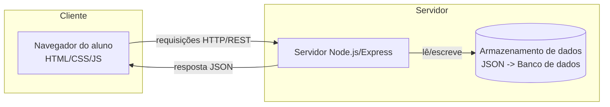

# Proposta e Especificação do Projeto — Etapa 01

## 1. Nome da aplicação

**StudyFlow**

## 2. Descrição do problema

Estudantes costumam cursar várias matérias ao mesmo tempo, cada uma com suas
próprias tarefas, trabalhos e prazos de entrega. Sem uma ferramenta central para
organizar essas informações, é comum perder prazos, esquecer atividades ou
não ter uma visão clara do que precisa ser feito em cada período. Planilhas e
agendas de papel não se adaptam bem à rotina dinâmica de um curso, em que
tarefas surgem e mudam de prioridade constantemente.

O **StudyFlow** propõe resolver esse problema oferecendo um sistema web onde o
aluno cadastra suas matérias e as tarefas associadas a elas, acompanhando
prazos e status de conclusão em um único lugar.

## 3. Público-alvo

Estudantes do ensino superior (graduação) que cursam múltiplas disciplinas
simultaneamente e precisam organizar tarefas, trabalhos e prazos acadêmicos.

## 4. Objetivo principal da aplicação

Permitir que o aluno organize sua rotina acadêmica cadastrando matérias e
tarefas, acompanhando prazos de entrega e o status de conclusão de cada
atividade, com uma visão centralizada do que precisa ser feito.

## 5. Funcionalidades da versão inicial

1. Cadastro de matérias (nome, e futuramente cor/identificação visual).
2. Cadastro de tarefas vinculadas a uma matéria.
3. Definição de data de entrega para cada tarefa.
4. Controle de status da tarefa: **pendente** ou **concluída**.
5. Página inicial listando as tarefas cadastradas, com destaque para as
   pendentes.
6. Edição e exclusão de matérias e tarefas.

### Funcionalidades planejadas para etapas futuras

- Calendário de tarefas e prazos.
- Dashboard com visão geral do progresso.
- Filtros de tarefas por matéria.
- Prioridade das tarefas (alta, média, baixa).
- Sistema de login e autenticação de usuários.
- Persistência em banco de dados relacional.
- Notificações de prazos próximos.
- Estatísticas de desempenho (ex: % de tarefas concluídas no prazo).

## 6. Entidades / conceitos do domínio

- **Usuário**: pessoa que utiliza o sistema (na versão inicial, um único
  usuário local; em etapas futuras, com login).
- **Matéria**: disciplina cursada pelo aluno, à qual as tarefas são
  associadas (ex: "Cálculo I", "Banco de Dados").
- **Tarefa**: atividade acadêmica vinculada a uma matéria, com data de
  entrega e status (pendente/concluída).

## 7. Telas / interfaces

1. **Página inicial (Home)**: lista todas as tarefas cadastradas, exibindo
   matéria, título, data de entrega e status. Tarefas pendentes e próximas
   do prazo são destacadas.
2. **Tela de cadastro/edição de matéria**: formulário simples para criar ou
   editar o nome de uma matéria.
3. **Tela de cadastro/edição de tarefa**: formulário para criar ou editar
   uma tarefa, selecionando a matéria, título, descrição, data de entrega e
   status.

## 8. Operações da aplicação

1. Criar matéria.
2. Editar matéria.
3. Excluir matéria.
4. Criar tarefa (associada a uma matéria).
5. Editar tarefa.
6. Excluir tarefa.
7. Marcar tarefa como concluída/pendente.
8. Listar tarefas na página inicial.

## 9. Tecnologias no cliente

- HTML5, CSS3 e JavaScript puro na versão inicial, para manter a etapa 01
  simples e focada na especificação.
- Possível evolução para um framework (ex: React) nas etapas seguintes,
  conforme os conteúdos forem estudados em aula.

## 10. Tecnologias no servidor

- Node.js com Express, expondo uma API REST para operações de matérias e
  tarefas.

## 11. Tecnologia de persistência

- Início com armazenamento em arquivo JSON local no servidor, para permitir
  o desenvolvimento incremental sem a complexidade de um banco de dados
  desde o primeiro momento.
- Evolução planejada para um banco de dados (ex: SQLite ou PostgreSQL) em
  etapa futura, quando os conteúdos de persistência forem abordados em aula.

## 12. Diagrama simples da solução

O aluno interage com a interface web (cliente), que envia requisições para o
servidor Node.js/Express. O servidor processa as operações de matérias e
tarefas e persiste os dados, retornando as informações atualizadas para
exibição na interface.
